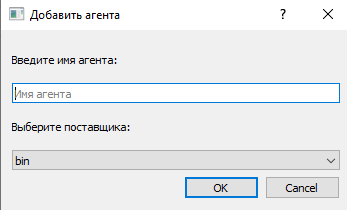

# Fisher Docs RU
Пользовательская документация Fisher на русском

## Оглавление
1. [Введение](#введение)
2. [Начало работы](#начало-работы)
3. [Настройки](#настройки)
4. [Поставшик](#поставщики)
5. [Агенты](#агенты)

## Введение
Программное обеспечение для работы с извесными криптобиржами. Создание гибких торговых стратегий, с возможностью добавлять функционал. Создание системы оповещений, как о работе стратегий, так и оповещений для удобства ручной торговли.
Приложение локально, что гарантирует безопасность.

## Начало работы
Агент - отвечает за работу с биржами, позволяет создавать собственные автоматические сценарии торговли.
Во вкладке "Настройки" выберете путь до папки где будут созаваться агенты.
Для создание агента, необходимо подключить поставщика данных во вкладке "Поставщики". Там будет возможнасть ввести имя, выбрать доступного поставщика, и ввести ключи для манипулирования личным ссчетом. Имя поставщика должно быть уникальным, можно подключать несколько аккаунтов одной биржи, они не будут конфликтовать.
Во вкладке "Агенты", можно создать агента введя имя и выбрав ранее созданого поставщика. 
Теперь в выбраной папке создался раздел с именем вашего агента, файл run_... нуден для написания вашей стратегии

## Настройки

В меню инструменты, есть вкладка "Настройки", где можно выбрать язык интерфейса и расположение файлов агентов.
Язык интерфейса изменится вступит в силу после перезапуска приложения.
Расположение файлов интерфейса, содержит путь где можно обнаружить папки с названием равным имени ваших агентов. Файл run_имя-агента.py содержит центральную логику агента.

## Поставщики

В меню инструменты, есть вкладка "Поставщики", где можно подключить своего поставщика данных.
Для подключения поставщика необходимо нажать (+), вправом нижнем углу интерфейса. 

В открывшемся диологовом окне необходимо: 
   1. Ввести придуманое имя, 
   2. Выбрать из доступных поставщика данных,
   3. Ввести ключи API от поставщиков (необходимо создать на сайте поставщика)

После этого в списке поставщиков, появится ваш созданный поставщик.

## Агенты

В меню инструменты, есть вкладка "Агенты", где можно подключить своего агента.
Для сохдания нового агента необходимо нажать (+), вправом нижнем углу интерфейса. 

В открывшемся диологовом окне необходимо: 
   1. Ввести имя агента, 
   2. Выбрать из списка своего [поставшика](#поставщики),

После этого в списке агентов, появится ваш созданный агент.

